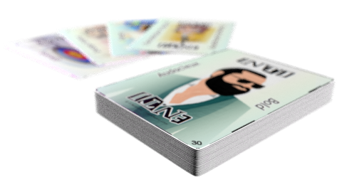
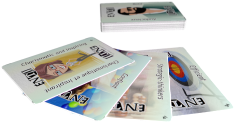

## Bienvenue dans le jeu de relations de personnalités

L'objectif de ce jeu est d'améliorer le travail d'équipe et la compréhension des relations au sein des équipes.

Pour ce faire, nous proposons un jeu professionnel de 250 cartes et des formations pour:

* Entreprises
* Petites et moyennes entreprises
* Facultés et écoles (personnel et étudiants)
* Personnel des OSBL

Le jeu comprend:

* 37 questions pour identifier votre personnalité
* 16 personnalités ont décliné en 238 traits
* 7 situations de départ
* 2 langues par jeu pour une configuration multiculturelle
* 1 mini-jeu pour aider à résoudre les conflits interpersonnels

La formation comprend:
* Perspectives de personnalités
* Pourquoi certaines combinaisons de personnalité fonctionnent et d'autres pas
* Pour faire correspondre les personnalités et les rôles
* Comprendre la dynamique des relations
* Modèle de résolution de conflit
* Exploiter l'assertivité pour toutes les cultures et toutes les personnalités
* Identifier les forces et les faiblesses au sein des équipes et de soi
* Identifier la dynamique des conflits
* Créer et déployer des réponses coordonnées par l'équipe avec succès
* Développer la compréhension et la connaissance des équipes sur les processus collectifs

# Pourquoi un jeu de cartes? 📇
* Permettre à tout le monde de jouer
* Développer des relations et des interactions entre les acteurs
* Prendre le temps de découvrir les traits de personnalité (les vôtres et les autres)
* Pour jouer comme un jeu de cartes, cela aide à éliminer le stress
* Pour jouer avec tout le monde, de 13 à 113 ans
* Pour jouer sans avoir besoin de télécharger + installer + autoriser quelque chose sur un appareil

